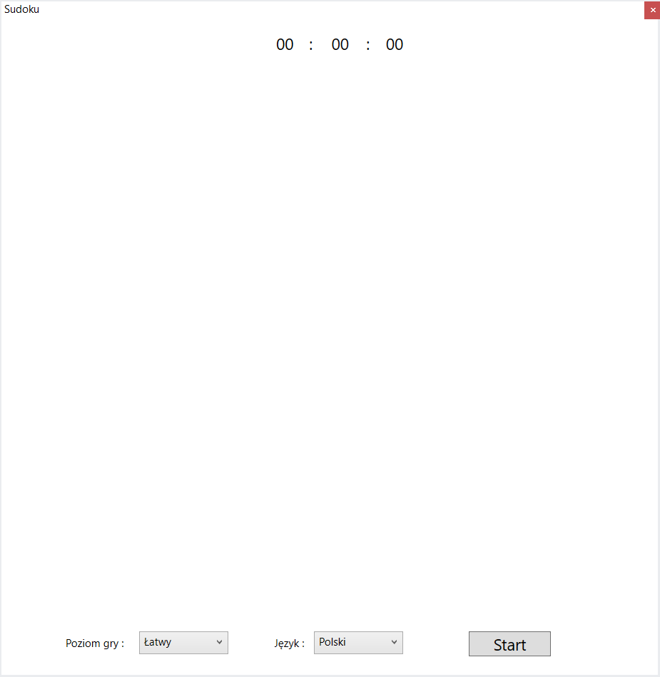

# Sudoku.GUI - description

Start screen

### Sudoku.GUI - you can change the language and level of the game

Selection panel in Polish

Selection panel in English

Choice of difficulty level

#

Disable selection list : 
  - after pressing the start button, level and language selection lists are disable

#
Timer of game - counts how much time has passed 
since the start of the game

#
Game board:
  - squares with a blue frame are the starting values given by Sudoku.Engine
  - the remaining squares are the values that you need to find to solve sudoku
  

#
MouseMuve - when you hover over the button, 
the area checked after clicking will be highlighted

#
Pause panel : 
  - turns on when you click the pause button
  - the game and timer are stopped
the area checked after clicking will be highlighted

